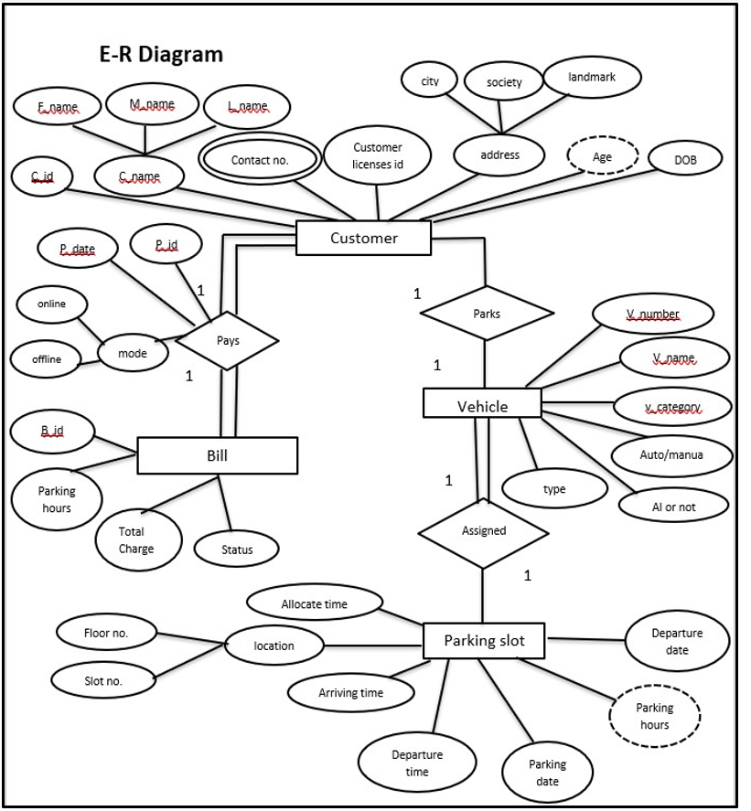
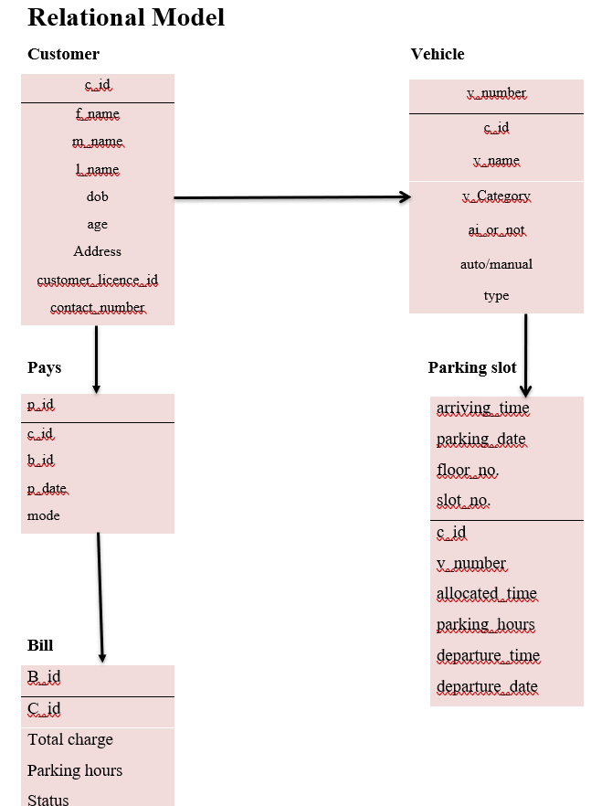

# Parking Management System – Database Design Project

This project was created as part of my **Database Fundamentals** course during my 2nd semester of Bachelor's.  
It focuses on the complete database design process—from case study analysis to ER modeling, relational schema creation, and SQL implementation.

---

## 📘 Project Overview

The Parking Management System manages:
- Customer details  
- Vehicle information  
- Parking slots  
- Billing and payment records  

The goal was to understand:
- Identifying entities and attributes
- Defining cardinality and relationships
- Building ER diagrams & relational models
- Implementing the schema in Oracle SQL
- Running basic to advanced SQL queries

---

## 📂 Repository Structure

```
parking-management-system/
├── sql/
│   └── parking_management.sql
├── docs/
│   ├── ERD.png
│   ├── relational_schema.png
│   └── Case_Study_Report.pdf
└── README.md
```
## 🗃️ ER Diagram & Relational Schema

Below are the key documents of the design phase:

### **ER Diagram**


### **Relational Schema**


## 🛠️ SQL Features Implemented

The SQL script includes:

### **Database Design**
- Table creation (`customer`, `vehicle`, `parking_slot`, `bill`, `pay`)
- Primary keys & foreign keys
- Constraints (`CHECK`, `UNIQUE`, `NOT NULL`)
- Referential integrity

### **Data Operations**
- Insert sample data
- UPDATE statements
- DELETE statements
- TRUNCATE and DROP

### **Querying**
- Selection & filtering
- Joins (natural, left, right, full outer)
- Aggregations  
- Sorting & grouping  
- Pattern matching using `LIKE`

---

## ▶️ How to Run

1. Install **Oracle SQL**, **MySQL**, or **PostgreSQL**  
2. Open your SQL editor  
3. Run the script:
sql/parking_management.sql

4. Query the tables as needed.

---

## 🎯 Learning Outcomes

- Strong foundation in **ER modelling**
- Understanding **relational modeling**
- Hands-on experience with **SQL commands**
- Knowledge of **database normalization** and constraints
- Real-world case study experience

---

## 📄 License
This project is for academic and learning purposes.
